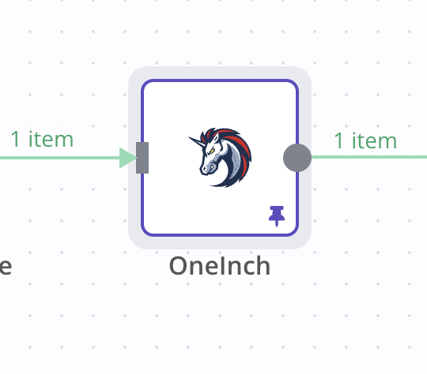

# n8n-nodes-dexscreener

This nodes automatically execute 1inch trades for you. It supports all the network that 1inch supports.

It allows user to customize RPC endpoint and slippage. The gas and gas price are calculated by 1inch.

In order to run the nodes, users need to set up a new wallet with the privatekey in n8n.

# Install
You can install the community package on the n8n Web GUI, Settings -> Community nodes -> Install a community node, type "n8n-nodes-binance" in the input box.

You can find deailted installation guide at [n8n website](https://docs.n8n.io/integrations/community-nodes/installation/#install-a-community-node).
